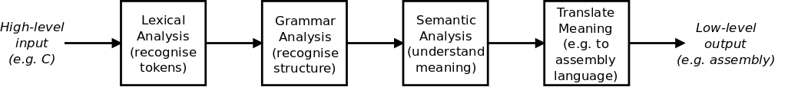

# Notes

## Basics of Compiler's Job


  - Do lexical analysis to recongnise the lexical elements .
  - Grammar Analysis - recognise the syntax of input and ensure that they follow the grammar of the language. 
  - Semantic Analysis - undertand the meaning of input
  - Translate the input to a different language

## BNF - Backus-Naur Form
  - Notation system for defining the syntax of programming languages
  - Example
    ```
      expression: number
                | expression '*' expression
                ;
      number:  T_INTLIT
                ; 
    ```

## Parse Tree vs Abstract Syntax tree 
  - Parse tree are tree that represents the syntatic sturcture of input is called the Parse Tree and the 
  - Abstract syntax tree show us the significant pieces of an expression / the abstracted syntax of text.
  - Todo-> Add a diagram showing the complete process 


## Operator Precedence 

  ### Method 1 - Making the operator precedence explicit in language's grammar
    
  - Here is a example of normal grammer.
    
      ```
      expression: number
          | expression '*' expression
          | expression '/' expression
          | expression '+' expression
          | expression '-' expression
          ;
    
      number:  T_INTLIT
              ;
      ```
    
    You can add the Operator Precedence directly to the grammar
    
      ```
      expression: additive_expression
          ;
      
      additive_expression:
            multiplicative_expression
          | additive_expression '+' multiplicative_expression
          | additive_expression '-' multiplicative_expression
          ;
      
      multiplicative_expression:
            number
          | number '*' multiplicative_expression
          | number '/' multiplicative_expression
          ;
      
      number:  T_INTLIT
              ;
      ```
    The above way of constructing recursive a recursive parser will eb inefficient, so instead of this we will choose a different method
    
  ### Method 2 - Pratt Parsing (can be wrong)
  - In Pratt Parser , each token knows how to parse itself by having two functions
      - Null Denotation(nud): This is used when a token apperas at beginning of an 
        expression. eg a no returns its value or a minus sign might indicate a unary negation 
      - Left Denotation(led): This is used when a token apperars after another expression
        eg. + operator combines left expression and the right expression
  - A Pratt Parser has a single recursive function that reads the token, uses `nud` functions
  to get value,if an operator with high enough precedence appears, calls `led` function to combine the expression.
  - The `right-binding-power(rbp)` is essentialy a threshold.The parser will continue to call itself recursively if the 
  `rbp` of current token / operator is higher than the previous `rbp` .
  - Example Walkthrough  ` 3 + 4 * 2 / 1 - 5 ` , Here `+` and `-` have binding power 0 and rest of operators has 20 as their binding power
      - The parser start with token `3` and calls the `nud` function and creates a leaf node for 3
      - The parser then sees `+` (binding power 10) which is higher than starting rbp(0), so it calls `led` function
      - A node is created for `+` with left node being `3` and calles the parser recursively with `rbp = 10` to parse the right part of `+` 
      - Now the parser sees 4, and calls the `nud` function.
      - Next , parser finds `*` (binding power 20) and which is greater that current rbp (10),it calls `led` function with `rbp =20` .
      - And also makes a multiplication node with left child `4`.
      - Now parser creats leaf node for 2 and sees `/` opertor which also rbp equal the previous rbp.
      - Because of this parser, completes the multiplication node and makes it the left node of `/` node.And again calls parser recursively with `rbp=20` to process the right side of `/`
      - Parser sees the `1` and makes a node for it . Then sees the `-` . 
      - As the binding power of `-` is less than 20 . We return .
      - Now the right child of `+` node becomes the expression we parsed till now .
      ```
      
              (+)
            /   \ 
          3      (/)
                /   \
              (*)    1
             /   \ 
            4     2
      ``` 
      - Now the above tree becomes the left node for `-` node and the right node becomes the `5`.
      - The final AST becomes as follows
      ```
                  (-)
                /     \
              (+)       5
            /   \ 
          3      (/)
                /   \
              (*)    1
             /   \ 
            4     2
      ```  The final tree looks like 
      